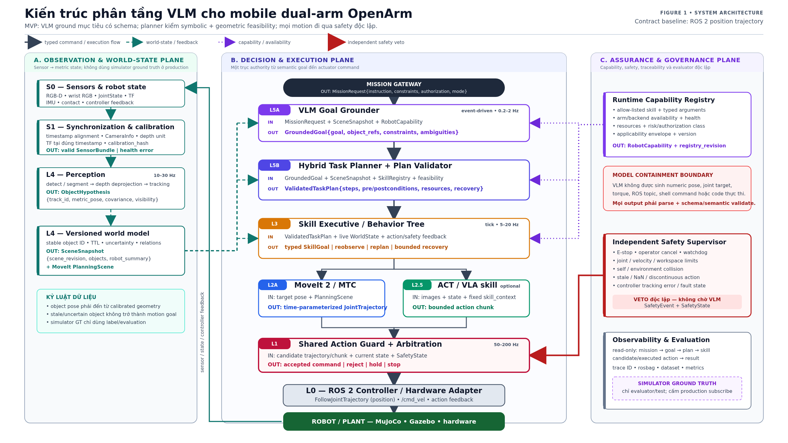
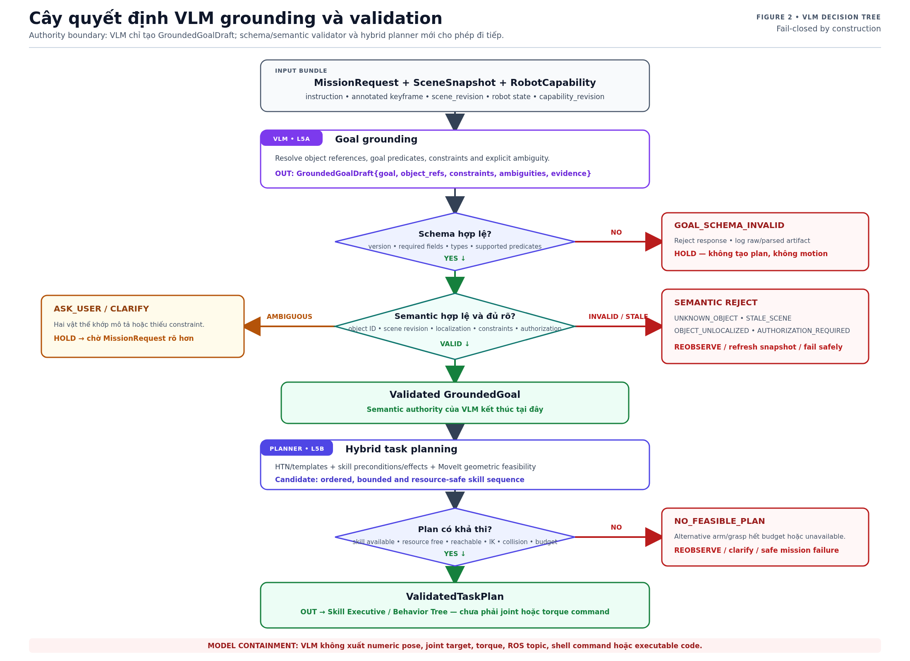

# Bộ hình kiến trúc VLM cho báo cáo OpenArm

**Trạng thái:** `PROPOSAL`, kiến trúc mục tiêu; không phải tuyên bố các package VLM/MoveIt/ACT đã
được implement trong repository hiện tại.

Đối với báo cáo chính, **Figure 1 là hình duy nhất cần dùng**. Figure 2 là hình bổ sung khi cần
giải thích sâu logic validation; không bắt buộc đưa vào slide tổng quan. Tài liệu giữ hai file
riêng để không nhồi toàn bộ kiến trúc và logic validation vào cùng một canvas:

1. **Figure 1:** block architecture của toàn hệ thống robot;
2. **Figure 2:** cây quyết định riêng của VLM grounding và validation.

## Figure 1 — Kiến trúc phân tầng VLM–robot



File báo cáo:

- [SVG vector chỉnh sửa được](assets/vlm_robot_architecture_tree_vi.svg)
- [PNG 2560×1440](assets/vlm_robot_architecture_tree_vi.png)
- [PNG 8K 7680×4320 cho trình chiếu/zoom](assets/vlm_robot_architecture_tree_vi_7680x4320.png)

**Caption đề nghị:**

> **Hình 1. Kiến trúc phân tầng VLM cho mobile dual-arm OpenArm.** Observation plane tạo world
> state có version từ sensor đã đồng bộ và calibration. Decision and execution plane biến
> `MissionRequest` thành `GroundedGoal`, `ValidatedTaskPlan`, typed skill và guarded actuator
> command. Assurance plane cung cấp capability, safety veto độc lập, traceability và evaluator.

### Cách đọc Figure 1

Thân cây authority ở giữa đi từ trên xuống:

```text
MissionRequest
→ VLM Goal Grounder
→ GroundedGoal
→ Hybrid Task Planner + Plan Validator
→ ValidatedTaskPlan
→ Skill Executive / Behavior Tree
→ MoveIt/MTC hoặc ACT/VLA skill
→ Shared Action Guard
→ ROS 2 Controller
→ MuJoCo / Gazebo / hardware
```

Ba plane có trách nhiệm tách biệt:

| Plane | Trách nhiệm | Có quyền điều khiển trực tiếp? |
|---|---|---|
| Observation & World-State | sensor sync, calibration, perception, world model | Không |
| Decision & Execution | semantic goal, task plan, skill, motion execution | Chỉ qua Action Guard |
| Assurance & Governance | capability, safety veto, trace, evaluator | Safety có quyền reject/stop |

Quy ước connector:

| Kiểu đường | Ý nghĩa |
|---|---|
| Xám liền | typed command hoặc execution flow |
| Xanh teal nét đứt | world state và closed-loop feedback |
| Tím chấm | capability/availability feed |
| Đỏ liền | independent safety veto |

## Figure 2 — Phụ lục: cây quyết định VLM grounding và validation



File báo cáo:

- [SVG vector chỉnh sửa được](assets/vlm_grounding_decision_tree_vi.svg)
- [PNG 2200×1600](assets/vlm_grounding_decision_tree_vi.png)
- [PNG 3× 6600×4800 cho trình chiếu/zoom](assets/vlm_grounding_decision_tree_vi_6600x4800.png)

### Chọn định dạng khi trình chiếu

- Ưu tiên **SVG** nếu phần mềm trình chiếu/báo cáo hỗ trợ: chữ và đường vector phóng lớn không vỡ.
- Dùng **PNG 8K/3×** khi công cụ chỉ nhận raster hoặc cần zoom sâu trong lúc thuyết trình.
- Dùng PNG thường cho README/web preview để tải nhanh hơn.
- Không chụp màn hình từ README rồi đưa vào slide; dùng trực tiếp file trong `docs/assets/`.

**Caption đề nghị:**

> **Hình 2. Cây quyết định VLM grounding và validation.** VLM tạo `GroundedGoalDraft` từ mission,
> scene snapshot và capability. Schema validator và semantic validator chặn output sai, stale,
> unlocalized hoặc ambiguous. Chỉ `GroundedGoal` hợp lệ mới đi vào hybrid planner; planner tiếp
> tục kiểm skill, resource và geometric feasibility trước khi tạo `ValidatedTaskPlan`.

### Input/output khoa học của cây quyết định

| Khối | Input | Output thành công | Output lỗi/fallback |
|---|---|---|---|
| VLM Goal Grounder | `MissionRequest`, `SceneSnapshot`, `RobotCapability`, keyframe | `GroundedGoalDraft` | timeout/model error → hold |
| Schema Validator | draft JSON + supported schema/version | schema-valid draft | `GOAL_SCHEMA_INVALID` |
| Semantic Validator | draft + live scene/capability/authorization | validated `GroundedGoal` | clarify, reobserve hoặc reject |
| Hybrid Task Planner | goal + skill domain + resource + feasibility | candidate skill sequence | `NO_FEASIBLE_PLAN` |
| Plan Validator | plan + budgets + live revisions | `ValidatedTaskPlan` | reject/replan |

## Bốn câu nhớ nhanh

1. **VLM = WHAT:** hiểu object reference, goal, constraint và ambiguity.
2. **Planner = FEASIBLE:** kiểm skill, precondition, resource, IK và collision feasibility.
3. **MoveIt/ACT = HOW:** tạo chuyển động cục bộ cho một skill đã được cho phép.
4. **Safety = PERMITTED:** quyết định candidate command nào được tới actuator.

## Model containment boundary

Trong MVP, VLM không được output:

- numeric object pose;
- joint target hoặc torque;
- `/cmd_vel` sequence;
- ROS topic/action name tùy ý;
- shell command, Python hoặc executable code.

VLM chỉ tạo `GroundedGoalDraft`. Output phải qua schema validation, semantic validation và hybrid
planning trước khi executive có thể gọi skill.

## Bài trình bày 60–90 giây

> “Hình 1 mô tả toàn bộ kiến trúc. Sensor không đi thẳng vào VLM mà phải qua sync, calibration,
> perception và world model để tạo `SceneSnapshot` có version. VLM chỉ ground câu lệnh thành
> `GroundedGoal`; hybrid planner mới kiểm skill và hình học để tạo `ValidatedTaskPlan`. Behavior
> Tree chạy từng skill; MoveIt dùng cho chuyển động hình học xác định, ACT là learned-skill tùy
> chọn. Cả hai đều qua cùng Action Guard và safety veto độc lập trước ROS 2 controller.
>
> Hình 2 zoom riêng vào VLM. Bất kỳ output sai schema đều bị reject. Nếu object mơ hồ thì hỏi lại;
> nếu scene stale hoặc object chưa localize thì reobserve. Chỉ goal hợp lệ mới vào planner, và chỉ
> plan khả thi mới trở thành `ValidatedTaskPlan`. Vì vậy model không có đường trực tiếp tới joint,
> torque hoặc controller.”

## Phạm vi bằng chứng

- **FACT:** source workspace hiện nhắm Gazebo Harmonic/Jazzy và có base `/cmd_vel`,
  odometry, joint-state, lidar `/scan`, RGB-D image/depth, Nav2
  bringup, hotel world và skeleton-lift profile. Runtime acceptance
  Jazzy/Harmonic đã PASS;
  RGB-D được kiểm chứng ngày 2026-08-26, xem `docs/TEST_REPORT.md`.
- **FACT:** MuJoCo/trajectory-action foundation chỉ tồn tại trong project legacy; workspace v1.2
  hiện chưa tích hợp MuJoCo, application-level perception, MoveIt, VLM hoặc ACT stack.
- **PROPOSAL:** hai hình mô tả target architecture đã được chọn cho roadmap.
- **REQUIRED:** simulator ground truth chỉ dùng evaluator/test, không đi vào production observation.

Tài liệu kiến trúc và roadmap chi tiết nằm tại
`/home/hai/ghrc2026/docs/vlm-study/`.
